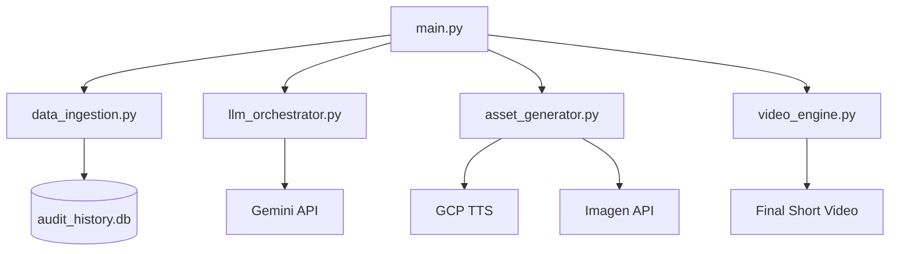

# "The Daily Audit" Pipeline System Architecture (v3.0)

This documentation details the system design, data flow, security model, and directory layout of the automated YouTube Shorts channel engine.

## Core Pipelines & Flow

1. **Ingest & Check**: Selects historical/scientific misconceptions and validates uniqueness using `audit_history.db`.
2. **Script Generation**: Calls Google Gemini 2.5/3.0 Pro using the official Python SDK to produce structured JSON detailing hooks, explanations, prompts, and YouTube metadata, incorporating dramatic SSML breaks.
3. **Asset Generation**: Concurrently creates a vintage document/blueprint image (Imagen 4.0 cascade) and TTS voice audio (Google Cloud Text-to-Speech).
4. **Video Compilation**: Uses `moviepy` + `PIL` + `numpy` to compile the visual. Applies a diagonal red `[CLASSIFIED AUDIT FILE]` watermark stamp for the first 3.0 seconds, scrolling scanline drift, organic film grit, a 0.4s horizontal displacement glitch transition, an elastic bounce card reveal of the custom yellow-header "EXHIBIT A: FORENSIC EVIDENCE" card, and dynamic category-routed audio ducking (with mechanical `stamp.mp3` sound effect starting at `t = 0.0s`).
5. **Publishing**: Headlessly publishes the video to YouTube and Facebook Reels.

## Component Flow Diagram

## Architectural Security
- API keys reside solely in local `.env` configuration.
- Local token cache (`credentials.json`) allows continuous headless execution.
- Least privilege access scopes (`youtube.upload`) strictly enforced.
- SQL inputs are fully parameterized.

For the full detailed architecture specification, see [Architecture.md](file:///c:/Users/imran/auto-youtube-project/production_artifacts/Architecture.md).
