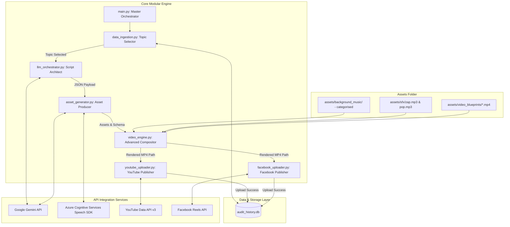

# System Architecture: "The Daily Audit" Immersive Shorts Pipeline (v3.0)

## 1. Executive Summary & Design Philosophy
This document details the architectural updates for Version 3.0 of the "The Daily Audit" shorts generator. 

The design philosophy for v3.0 focuses on **video blueprint-driven visual immersion** and **hardware-accelerated rendering performance**. We replace static, blurred image backgrounds with dynamic, loopable thematic video blueprints from `app_build/assets/video_blueprints/`. To handle the increased computational load of compositing layers of video, we introduce auto-detected GPU/CUDA acceleration and full CPU multi-threading.

---

## 2. System Architecture & Core Boundaries

---

## 3. Component Design Updates

### 3.1 Topic/Keyword Video Blueprint Router (`video_engine.py`)
- Automatically routes the video script topic/category to the most appropriate video blueprint file.
- Contains a dictionary mapping key terms (e.g. `clockwork`, `hour`, `network`, `dna`, `curtain`, `server`) to specific files in `app_build/assets/video_blueprints/`.
- Falls back to `Golden_dust_particles_in_light_202605221756.mp4` if no matching keywords are found.

### 3.2 Immersive Background Layer & Foregrounds
- **Background Video Loop**: Loads the selected video blueprint using MoviePy's `VideoFileClip`. If shorter than the scene, loops the clip programmatically (`clip.loop(duration=total_duration)`).
- **Foreground Overlay**: Integrates the forensic tech card overlay (`Exhibit A`, `Exhibit B`) on top of the moving background starting at `t = 0.2s` with elastic bounce zoom.
- **Glitch Cue VFX**: Syncs pre-transition glitching (last 0.15s of Scene 1 and Scene 2) and glitch transitions (0.5s) using horizontal row shifting and color channel offsets applied directly to the video frames.

### 3.3 Hardware Acceleration & Rendering Pipelines
- **NVIDIA GPU NVENC Check**: Detects if NVENC is available via a system check for the `h264_nvenc` FFmpeg encoder.
- **Dynamic Thread Selection**: Configures MoviePy's `write_videofile` to use `threads=os.cpu_count()`.
- **Encoder Dispatch**: Selects `codec="h264_nvenc"` on supported platforms, falling back to CPU multi-threaded `libx264` if CUDA is unavailable.

---

## 4. Resource Constraints & Optimizations
- **Video Resource Disposals**: All temporary video background subclips, audio tracks, and composite clips are explicitly closed using context managers or `.close()`, followed by garbage collection `gc.collect()`.
- **Unblurred Transition Highlights**: If the story narration exceeds 6 seconds, the background video's Gaussian blur is dynamically reduced or completely removed to show the high-fidelity video background until the next scene transition.

---

## 5. Sign-Off & Verification

🏛️ **Architecture Approved**
